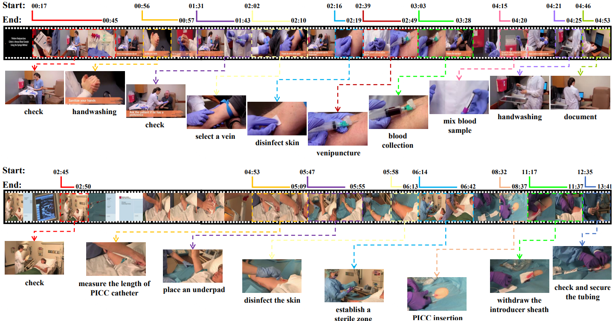

# NurViD: A Large Expert-Level Video Database for Nursing Procedure Activity Understanding
[Ming Hu](https://minghu0830.github.io/), [Lin Wang](https://wanglin-research.com/), [Siyuan Yan](https://github.com/SiyuanYan1), [Don Ma](), [Qingli Ren](), [Peng Xia](https://peng-xia.site/), [Wei Feng](https://fengweie.github.io/), [Peibo Duan](https://scholar.google.com/citations?user=wdIMVqsAAAAJ&hl=zh-CN), [Lie Ju](), [Zongyuan Ge](https://zongyuange.github.io/).


<a href=''></a>  <a href=''></a>


## Introduction
NurViD is a large video dataset with expert-level annotation for nursing procedure activity understanding. NurViD consists of over 1.5k videos totaling 144 hours. Notably, it encompasses 51 distinct nursing procedures and 177 action steps.



## Dataset Preparation
### Download videos
We provide two download options:

1.Download videos automatically from the source YouTube by running the script below：
```
python tools/download_videos.py
```
2.After signing the [data agreement form](), our team will send you the Google Drive link to your email.

### Preprocess videos
By running the script below, the video will be resized to the short edge size of 256 and a frame rate of 25 FPS:
```
python tools/preprocess_video.py
```

## Dataset and code release progress
- [x] Start release
- [x] Add video and annotation files
- [ ] Add RGB and Flow features
- [ ] Add code
