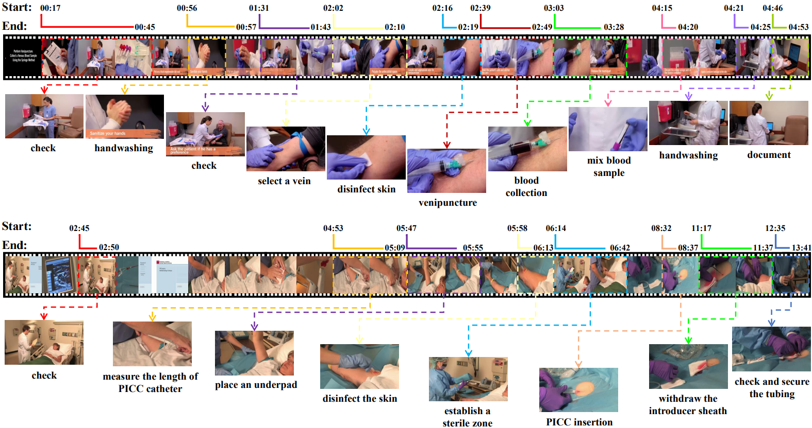

# NurViD: A Large Expert-Level Video Database for Nursing Procedure Activity Understanding
[Ming Hu](https://minghu0830.github.io/), [Lin Wang](https://wanglin-research.com/), [Siyuan Yan](https://github.com/SiyuanYan1), [Don Ma](), [Qingli Ren](), [Peng Xia](https://peng-xia.site/), [Wei Feng](https://fengweie.github.io/), [Peibo Duan](https://scholar.google.com/citations?user=wdIMVqsAAAAJ&hl=zh-CN), [Lie Ju](), [Zongyuan Ge](https://zongyuange.github.io/).

<a href=''></a>

## Introduction
NurViD is a large video dataset with expert-level annotation for nursing procedure activity understanding. NurViD consists of over 1.5k videos totaling 144 hours. Notably, it encompasses 51 distinct nursing procedures and 177 action steps.



## Installation

This package has the following requirements:
* `GCC >= 4.9`
* `python >= 3.8`
* `PyTorch >= 1.8`
* `Denseflow`
* `MMAction2`
* `PySlowFast`
### 1.Create a virtual environment
```
conda create --name nurvid python=3.9 -y
conda activate nurvid
pip install -r requirements.txt
```
### 2.MMAction2、PySlowFast、Denseflow
Please refer to the official websites of [MMAction2](https://github.com/open-mmlab/mmaction2), [PySlowFast](https://github.com/facebookresearch/SlowFast), [Denseflow](https://github.com/yjxiong/dense_flow)(Optional: A GPU-accelerated library designed for efficient extraction of optical flow features) for detailed instructions.

## Directory Structure
In the context of the whole project, the folder structure will look like:

```
NurViD-benchmark
├── annotations
│   ├── task1&3
│   │   ├── train.csv
│   │   ├── val.csv
│   │   ├── test.csv.csv
│   ├── task2
│   │   ├── procedure_train.csv
│   │   ├── procedure_val.csv
│   │   ├── procedure_testcsv
│   │   ├── action_train.csv
│   │   ├── action_val.csv
│   │   ├── action_test.csv
│   ├── NurViD_annotations.json
│   ├── Procedure&Action_ID.xlsx
├── feature_extraction
│   ├── feature
│   │   ├── --Ly-qjodoIs.npz
│   │   ├── -0z1P7sw2qs.npz
│   │   ├── ..
│   ├── build_rawframes.py
│   ├── extract_features.py
│   ├── ..
├── tools
│   ├── downloader.py
│   ├── preprocess_videos.py
│   ├── clip.py
├── model (Baseline models.)
│   ├── SlowFast
│   ├── C3D
│   ├── I3D
├── dataset
│   ├── Original_videos
│   │   ├── --Ly-qjodoI.mp4
│   │   ├── -0z1P7sw2qs.mp4
│   │   ├── ..
│   ├── Preprocessed videos
│   │   ├── --Ly-qjodoI.mp4
│   │   ├── -0z1P7sw2qs.mp4
│   │   ├── ..
│   ├── Segments
│   │   ├── --Ly-qjodoI_1.mp4
│   │   ├── --Ly-qjodoI_2.mp4
│   │   ├── --Ly-qjodoI_3.mp4
│   │   ├── ..
```

## Dataset Preparation

### 1.Download Videos
Download videos automatically from the source YouTube by running the script below：
```
python /tools/downloader.py
```
### 2.Preprocess Videos
By running the script below, the video will be resized to the short edge size of 256 and a frame rate of 25 FPS:
```
python /tools/preprocess_videos.py
```
### 3.Create Trimmed Segments
We clip the video into segments according to the order specified in the JSON annotation file and add a sequential number as a label.
```
python /tools/clip.py
```
### 4.Extract RGB and Flow Features
We start by extracting frames from each video at 25 frames per second and optical flow using the TV-L1 algorithm.:
```
python /feature_extraction/build_rawframes.py /video_path /rgb&flow_frmaes_save_path --level 1 --flow-type tvl1 --ext mp4 --task both
```
Next, we utilize a pre-trained I3D model on the ImageNet dataset to generate features for each RGB and optical flow frame:
```
python /feature_extraction/extract_features.py --mode rgb --load_model models/rgb_imagenet.pt --input_dir /rgb&flow_frmaes_save_path --output_dir /rgb_feature_save_path --batch_size 100 --sample_mode resize --no-usezip
python /feature_extraction/extract_features.py --mode flow --load_model models/flow_imagenet.pt --input_dir /rgb&flow_frmaes_save_path --output_dir /rgb_feature_save_path --batch_size 100 --sample_mode resize --no-usezip
```
To handle varying video durations, we perform uniform interpolation to generate 100 fixed-length features for each video. Lastly, we combine the RGB and optical flow features into a 2048-dimensional embedding as the model input.

### 5.Our Source
We also provide a method to directly access our data, but it requires you to sign the [data agreement form](https://form.jotform.com/232158342596158). Once you have completed the form, you will receive an email from our team with Google Drive and Baidu Netdisk download links (including original videos, preprocessed videos and features). Our dataset videos will be released soon, no later than the camera-ready deadline.

## Publications

## Acknowledgement

Part of our code is borrowed from the following repositories:

- [yt-dlp](https://github.com/yt-dlp/yt-dlp)
- [mmaction2](https://github.com/open-mmlab/mmaction2)
- [I3D Feature Extraction](https://github.com/Finspire13/pytorch-i3d-feature-extraction)
- [PySlowFast](https://github.com/facebookresearch/SlowFast/tree/main)

## License and Disclaimer
The CC-BY-4.0 license and disclaimer statement for the project can be found in the following file description：
```
CC BY 4.0 & Disclaimer.txt
```

## Dataset and Code Release Progress
- [x] Start release
- [x] Add video and annotation files
- [ ] Add RGB and Flow features
- [ ] Add code
